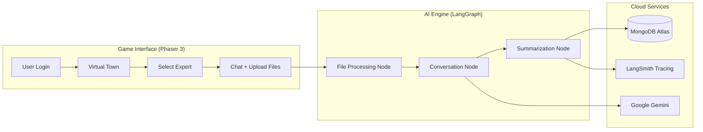

# Business Model Canvas Town

> **An Interactive AI-Powered Business Strategy Platform**

Business Model Canvas Town is an innovative software platform that combines the strategic power of the Business Model Canvas framework with cutting-edge AI technology. Through an engaging game-like interface, entrepreneurs and business professionals interact with specialized AI experts to develop, refine, and validate their business models.

---

## Executive Summary

| Aspect | Details |
|--------|---------|
| **Product Type** | SaaS / Enterprise Software |
| **Technology** | Generative AI + Interactive Gaming UI |
| **AI Engine** | Google Gemini (via LangGraph Orchestration) |
| **Target Market** | Entrepreneurs, Business Consultants, Educators, Accelerators |
| **Deployment** | Cloud-native (Docker, Google Cloud Run) |

---

## Core Features

### 🎮 Gamified Business Strategy Experience

A visually engaging virtual "town" built with the **Phaser 3** game engine where users navigate and interact with AI Business Experts. This approach dramatically increases user engagement compared to traditional form-based business planning tools.

### 🤖 Nine Specialized AI Business Experts

Each expert is a uniquely persona-driven AI agent mapped to one of the nine blocks of the Business Model Canvas:

| Expert Name | Domain | Specialty |
|-------------|--------|-----------|
| **Steven Segments** | Customer Segments | Market segmentation, persona development, customer behavior analysis |
| **Victor Value** | Value Propositions | Unique value articulation using "FOR...WE DELIVER...BY...SO THAT..." framework |
| **Chris Channels** | Channels | Distribution strategy, sales touchpoints, marketing channels |
| **Rita Relations** | Customer Relationships | Acquisition, retention, loyalty programs, community building |
| **Ryan Revenue** | Revenue Streams | Pricing models, revenue diversification, monetization tactics |
| **Rebecca Resources** | Key Resources | Physical, intellectual, human, and financial resource planning |
| **Alex Activities** | Key Activities | Core operational processes, efficiency, and workflow design |
| **Parker Partners** | Key Partnerships | Strategic alliances, supplier networks, joint ventures |
| **Carlos Costs** | Cost Structure | Cost drivers, expense analysis, economies of scale |

### 📎 Multimodal Document Processing

Users can upload supporting documents to receive contextualized advice:
- **PDF Documents**: Business plans, financial statements, market research
- **Images**: Product photos, mockups, whiteboard sketches, competitor screenshots

The AI experts analyze these files directly within the conversation, providing specific feedback grounded in the user's actual materials.

### 👤 Pre-Configured User Profiles & Personalization

One of the platform's most powerful features is **profile pre-configuration**. Admins or consultants can set up user profiles in advance, capturing:
- User's name and business name
- Industry sector and company stage
- Current business challenges and goals
- Competitive landscape and revenue details

When the user begins interacting with an AI expert, **the agent already knows their context and addresses them by name**. This creates an immediate sense of personalization and dramatically improves the user experience—the AI feels like a consultant who has already reviewed their case.

> [!TIP]
> Consulting firms can pre-configure dozens of client profiles before a workshop, enabling each participant to receive personalized AI guidance from their very first interaction.

All profile data is stored securely in **MongoDB Atlas** with token-based isolation.

### 🔐 Role-Based Access Control

The platform supports two access modes:

| Mode | Capabilities |
|------|--------------|
| **User Access** | Token-based login, personal profile management, game interaction |
| **Admin Access** | Password-protected dashboard, create/edit/manage all user profiles, full system access |

### 📊 Enterprise Observability & Evaluation

Built-in quality assurance through **LangSmith** integration:
- Complete conversation tracing and monitoring
- Automated evaluation pipelines
- Performance and quality metrics

---

## How It Works



### User Journey

1. **Login** — Users authenticate via token (or admins via password)
2. **Profile Setup** — Business context is captured or updated
3. **Navigate Town** — Users explore the virtual environment
4. **Consult Experts** — Engage with AI experts for targeted business advice
5. **Upload Documents** — PDFs and images are analyzed in real-time
6. **Iterate** — Refine business model through multiple conversations

### Example User Queries

The following examples demonstrate how users interact with AI experts using multimodal inputs:

| Scenario | Expert | User Query | Attachment |
|----------|--------|------------|------------|
| **Market Validation** | Steven Segments | *"I've attached a market research report from Gartner. Based on this data, which customer segments should I prioritize for my B2B SaaS product?"* | 📄 PDF: Market research report |
| **Value Prop Refinement** | Victor Value | *"Here's a sketch of our product interface. Help me articulate a compelling value proposition that highlights what makes this different from competitors."* | 🖼️ Image: Product UI mockup |
| **Cost Analysis** | Carlos Costs | *"I've uploaded our current expense breakdown. What are the biggest cost drivers, and where do you see opportunities for economies of scale as we grow?"* | 📄 PDF: Financial spreadsheet |

---

## System Architecture

### User Interface Layer

| Component | Technology | Description |
|-----------|------------|-------------|
| **Game Engine** | Phaser 3 | 2D game-based UI with interactive sprites and navigation |
| **Scene System** | MainMenu, Game, PauseMenu | Modular scene management |
| **Components** | Dropdown, ChatPanel, ProfileManager | Reusable UI elements |
| **API Client** | ApiService.js | REST communication with backend |

### Backend Services

| Component | Technology | Description |
|-----------|------------|-------------|
| **Web Framework** | FastAPI | High-performance async Python API |
| **AI Orchestration** | LangGraph | Stateful multi-step agent workflows |
| **LLM Provider** | Google Gemini | Multimodal generative AI |
| **Database** | MongoDB Atlas | Cloud-hosted document database |
| **Observability** | LangSmith | Tracing, monitoring, and evaluation |

### Security Features

| Feature | Implementation |
|---------|----------------|
| **Token-Based Auth** | Unique tokens per user profile |
| **Admin Authentication** | Environment-variable password protection |
| **File Isolation** | Files scoped to user session tokens |
| **Input Sanitization** | Filename sanitization, base64 validation |
| **Audit Logging** | Complete file processing audit trail |

---

## Evaluation & Quality Assurance

The platform includes a sophisticated evaluation system for continuous quality monitoring:

### Rule-Based Evaluators (Fast)
- **Conciseness Check**: Response word count < 50 words
- **Identity Safety**: Detection of phrases like "As an AI..."
- **File Integrity**: Verification of file payload claims

### LLM Judge (Gemini-Powered)
- Uploads user context files to Google's File API
- Deep semantic verification of response accuracy
- Hallucination detection by cross-referencing cited facts with source documents

---

## Business Goals

| Goal | How Platform Achieves It |
|------|--------------------------|
| **Lower Barriers to Strategy** | Intuitive game UI makes business planning accessible |
| **Personalized Expert Guidance** | AI experts provide tailored advice based on user context |
| **Document-Grounded Insights** | Multimodal processing ensures advice is grounded in real data |
| **Scalable Consulting** | One platform serves unlimited users without human consultants |
| **Continuous Improvement** | Built-in evaluation enables ongoing AI quality enhancement |

---

## Target User Personas

### 🚀 Early-Stage Entrepreneurs
**Need**: Step-by-step guidance through business model development  
**Value**: Affordable access to strategic expertise without hiring consultants

### 🏢 Business Accelerators & Incubators
**Need**: Scalable tool to support cohorts of startups  
**Value**: Consistent methodology across all participants with individualized feedback

### 📚 Business Educators
**Need**: Interactive teaching tool for business model curriculum  
**Value**: Engaging platform that students can use for hands-on learning

### 🎯 Consulting Firms
**Need**: Scale personalized consulting without proportionally increasing headcount  
**Value**: Pre-configure client profiles so AI experts provide tailored guidance from the first interaction; handle routine strategic questions automatically while consultants focus on high-value activities

### 💼 Individual Business Consultants
**Need**: Augmentation tool for client workshops and ongoing engagements  
**Value**: AI-assisted pre-work, documentation analysis, and 24/7 client support between sessions

### 🔄 Established Businesses
**Need**: Framework for exploring pivots or new product lines  
**Value**: Structured approach with expert prompting for strategic thinking

---

## Deployment & Operations

### Infrastructure

- **Containerization**: Docker with docker-compose for local development
- **Cloud Deployment**: Google Cloud Run with Cloud Build CI/CD
- **Database**: MongoDB Atlas (cloud-hosted, managed)

### Quick Start

```bash
# Start all services locally
make infrastructure-up

# Access the application
# Frontend: http://localhost:8080
# Backend API: http://localhost:8000

# Run evaluation suite
make evaluate-runs
```

### API Endpoints

| Endpoint | Method | Description |
|----------|--------|-------------|
| `/chat/business` | POST | Main conversation endpoint (multimodal) |
| `/chat/business/stream` | POST | Streaming conversation endpoint |
| `/business/user` | POST | Create new user profile |
| `/business/user/me` | GET | Retrieve current user profile |
| `/business/experts` | GET | List available AI experts |

---

## Competitive Advantages

✅ **Unique Gamified Interface** — Not another boring form-based tool  
✅ **Structured Framework** — Built on the proven Business Model Canvas  
✅ **Multimodal AI** — Understands text, PDFs, and images  
✅ **Personalized Context** — Remembers user's business details  
✅ **Enterprise-Ready** — RBAC, audit trails, and observability built-in  
✅ **Cloud-Native** — Deploys easily to any cloud provider  

---

## Technical Requirements

| Requirement | Specification |
|-------------|---------------|
| **Runtime** | Node.js 18+, Python 3.11+ |
| **API Keys** | Google Gemini, LangSmith (optional) |
| **Database** | MongoDB Atlas connection |
| **Deployment** | Docker, or Google Cloud Run |

---

## Contact & Licensing

This software is available for acquisition or licensing. For inquiries regarding:
- Enterprise licensing
- White-label solutions
- Custom integrations
- Technical demonstrations

Please contact the development team.

---

*Business Model Canvas Town — Where AI Meets Strategy*
